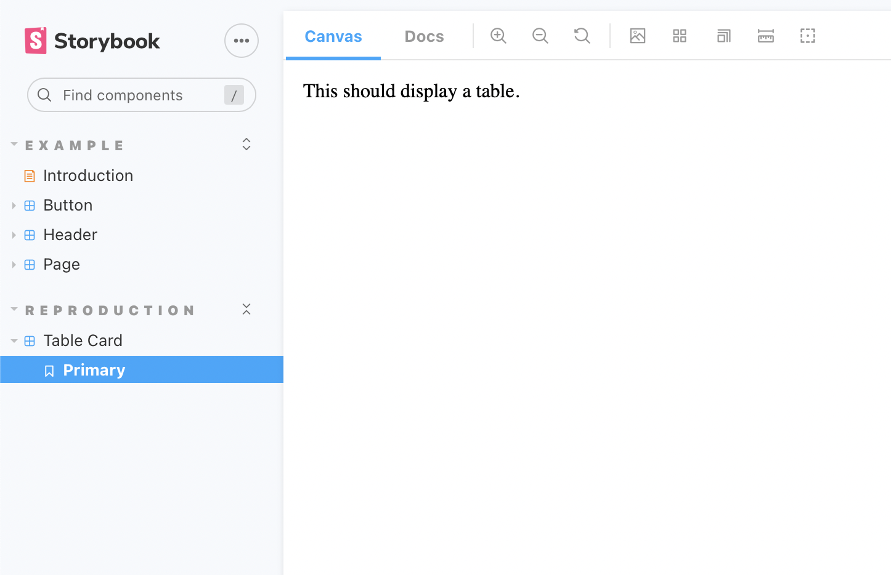
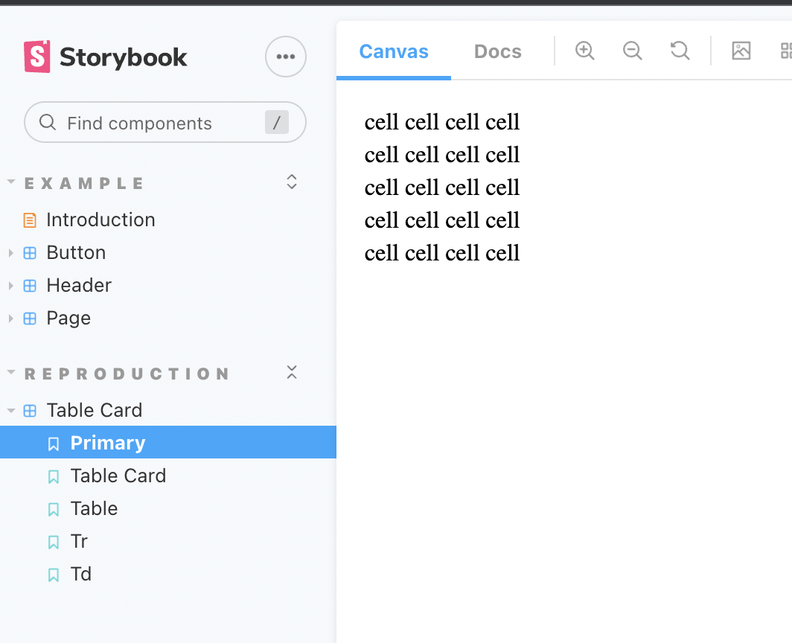
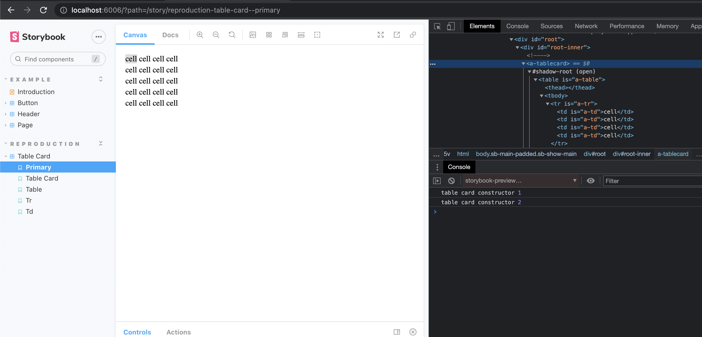

This repository reproduces two issues found in Storybook 6.4.x and 6.5-alpha.x.

-  Sub-components of Custom Elements cannot be included in a story template without exporting them, which causes Storybook to display erroneous stories in the Sidebar

- Custom elements in a Story template are instantiated twice, which can cause problems in components that add event listeners and so forth.

The first issue can be reproduced on the main branch. TableCard includes many children: Table, Tr, and Td, all customized built-in elements, but none of those components show up in DOM.

An undesirable workaround is found on the workaround/nested branch.

The second issue can be reproduced on issue/constructor branch. Upon inspecting the console.log, the constructor of the TableCard component fires twice, when it should only be called once.

NOTE: The polyfill for customized built-in elements is not installed so the custom elements included in this example will not work in Safari.

